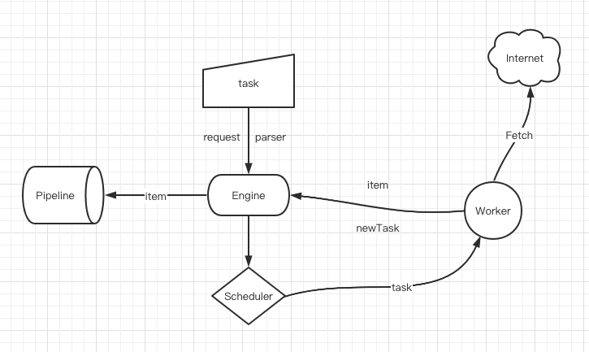

# nami
Simple Crawler, BFS

### Todo

- [x] proxy
- [ ] context
- [ ] optimize fetch
- [ ] error handling
- [ ] logger, middleware

## Credits
Library/Resource | Use
------- | -----
[github.com/gocolly/colly](https://github.com/gocolly/colly) | random user agent
[github.com/modood/Administrative-divisions-of-China](https://github.com/modood/Administrative-divisions-of-China) | example
